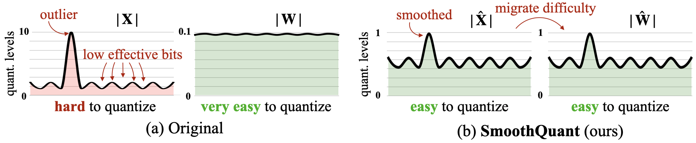
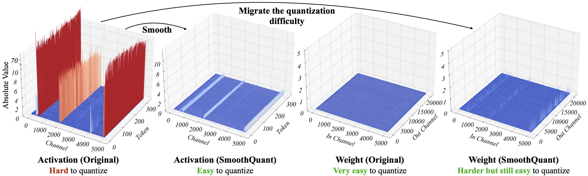
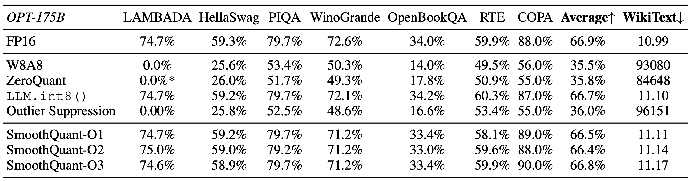
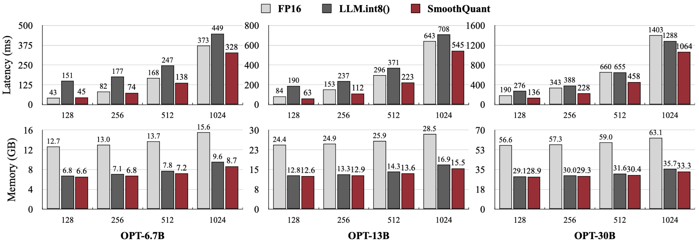
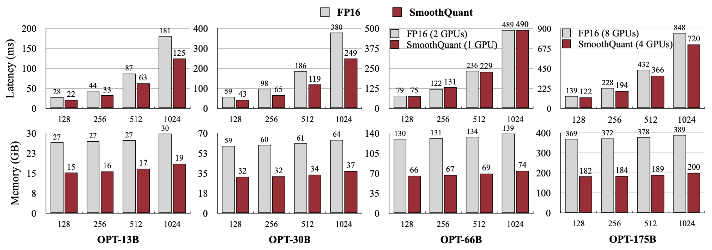

# SmoothQuant: Accurate and Efficient Post-Training Quantization for Large Language Models 
[[paper](https://arxiv.org/abs/2211.10438)] [[slides](assets/SmoothQuant.pdf)][[video](https://youtu.be/U0yvqjdMfr0)]



## News

- [2024/05] SmoothQuant enables INT8 model inference on [AMD Instinct MI300X using Composable Kernel](https://rocm.blogs.amd.com/software-tools-optimization/ck-int8-gemm-sq/README.html).
- [2024/03] We show SmoothQuant can enable W8A8 quantization for Llama-1/2/3, Falcon, Mistral, and Mixtral models with negligible loss. [Results](https://github.com/mit-han-lab/smoothquant?tab=readme-ov-file#perplexity-results-on-llama-123-falcon-mistral-and-mixtral-with-w8a8-quantization).
- [2024/01] SmoothQuant is integrated into Microsoft's [ONNX Runtime](https://github.com/microsoft/onnxruntime-inference-examples/tree/main/quantization/language_model/llama/smooth_quant).
- [2023/11] SmoothQuant is integrated into [Amazon SageMaker](https://aws.amazon.com/blogs/machine-learning/boost-inference-performance-for-llms-with-new-amazon-sagemaker-containers).
- [2023/10] SmoothQuant is integrated into NVIDIA [TensorRT-LLM](https://github.com/NVIDIA/TensorRT-LLM/).
- [2023/03] SmoothQuant is integrated into Intel [Neural-Compressor](https://github.com/intel/neural-compressor).

## Abstract

Large language models (LLMs) show excellent performance but are compute- and memory-intensive.
Quantization can reduce memory and accelerate inference.
However, for LLMs beyond 100 billion parameters, existing methods cannot maintain accuracy or do not run efficiently on hardware.
We propose SmoothQuant, a training-free, accuracy-preserving, and general-purpose post-training quantization (PTQ) solution to enable 8-bit weight, 8-bit activation (W8A8) quantization for LLMs.
Based on the fact that weights are easy to quantize while activations are not, SmoothQuant smooths the activation outliers by offline migrating the quantization difficulty from activations to weights with a mathematically equivalent transformation.
SmoothQuant enables an INT8 quantization of both weights and activations for all the matrix multiplications in LLMs, including OPT-175B, BLOOM-176B, GLM-130B, and MT-NLG 530B. SmoothQuant
has better hardware efficiency than existing techniques.
We demonstrate up to 1.56x speedup and 2x memory reduction for LLMs with negligible loss in accuracy.
We integrate SmoothQuant into FasterTransformer, a state-of-the-art LLM serving framework,
and achieve faster inference speed with half the number of GPUs compared to FP16, enabling the serving of a 530B LLM within a single node. Our work offers a turn-key solution that reduces hardware costs and democratizes LLMs.

## Installation

```bash
conda create -n smoothquant python=3.8
conda activate smoothquant
pip install torch==1.12.1+cu113 torchvision==0.13.1+cu113 torchaudio==0.12.1 --extra-index-url https://download.pytorch.org/whl/cu113
pip install transformers==4.36.0 accelerate datasets zstandard

python setup.py install
```

## Usage

### SmoothQuant INT8 Inference for PyTorch

We implement SmoothQuant INT8 inference for PyTorch with [CUTLASS](https://github.com/NVIDIA/cutlass) INT8 GEMM kernels, which are wrapped as PyTorch modules in [torch-int](https://github.com/Guangxuan-Xiao/torch-int). Please install [torch-int](https://github.com/Guangxuan-Xiao/torch-int) before running the SmoothQuant PyTorch INT8 inference.

We implement the quantized OPT model class in [smoothquant/opt.py](smoothquant/opt.py), which uses INT8 linear layers and bundles quantization scales. We provide the already smoothed and quantized OPT model at [https://huggingface.co/mit-han-lab/opt-[MODEL-SIZE]-smoothquant](https://huggingface.co/mit-han-lab/opt-[MODEL-SIZE]-smoothquant), where `[MODEL-SIZE]` can be `125m`, `1.3B`, `2.7B`, `6.7B`, `13B`, `30b`, and `66b`. You can load the INT8 model with the following code:

```python
from smoothquant.opt import Int8OPTForCausalLM
model = Int8OPTForCausalLM.from_pretrained("mit-han-lab/opt-30b-smoothquant")
```

You can also check [generate_act_scales.py](examples/generate_act_scales.py) and [export_int8_model.py](examples/export_int8_model.py) to see how we smooth, quantize and export INT8 models.

In [examples/smoothquant_opt_real_int8_demo.ipynb](examples/smoothquant_opt_real_int8_demo.ipynb), we use OPT-30B model to demonstrate the latency and memory advantages of SmoothQuant. We demonstrate on OPT-30B because it is the largest model we can run both the FP16 and INT8 inference on a single A100 GPU. For larger models requiring multiple GPUs, we recommend using the [FasterTransformer](https://github.com/NVIDIA/FasterTransformer) implementation of SmoothQuant.

### Activation Channel Scales and Calibration

We provide the activation channel scales for Llama, Mistral, Mixtral, Falcon, OPT, and BLOOM models in [act_scales/](act_scales/). We get those scales with 512 random sentences in the Pile validation set. You can use the OPT demo ([examples/smoothquant_opt_demo.ipynb](examples/smoothquant_opt_demo.ipynb)) and Llama demo ([examples/smoothquant_llama_demo.ipynb](examples/smoothquant_llama_demo.ipynb)) to test smoothing and quantizing those models.

We also provide the script to get the activation channel scales for your models. Please refer to [examples/generate_act_scales.py](examples/generate_act_scales.py). You can use the following command to get the scales for your models:

```bash
python examples/generate_act_scales.py \
    --model-name <model_name_or_path> \
    --output-path <output_act_scales_file_path> \
    --num-samples <num_samples> \
    --seq-len <sequence_length> \
    --dataset-path <path_to_the_calibration_dataset>
```

### Demo on OPT-13B with W8A8 Fake Quantization

In [examples/smoothquant_opt_demo.ipynb](examples/smoothquant_opt_demo.ipynb), we use OPT-13B as an example to demonstrate SmoothQuant can match the accuracy of FP16 and INT8 inference, while the naive baseline cannot. We simulate INT8 inference with FP16 ([smoothquant/fake_quant.py](smoothquant/fake_quant.py)), i.e., fake quantization.

### Perplexity Results on Llama-1/2/3, Falcon, Mistral, and Mixtral with W8A8 Quantization

We provide an evaluation script to evaluate the language modeling perplexity of OPT, BLoom, Llama, Falcon, Mistral, and Mixtral models with W8A8 simulated quantization. Please refer to [smoothquant/ppl_eval.py](smoothquant/ppl_eval.py). You can use the following command to evaluate the models:

```bash
python smoothquant/ppl_eval.py \
    --model_path <model_name_or_path> \
    --act_scales_path <act_scales_file_path> \
    --smooth \
    --alpha <alpha> \
    --quantize
```

Results:

| Model        | Method                              | PPL   | Alpha |
| ------------ | ----------------------------------- | ----- | ----- |
| Llama-2-7B   | FP16                                | 5.474 |       |
|              | [SQ W8A8](examples/ppl_eval.sh#L1)  | 5.515 | 0.85  |
| Llama-2-13B  | FP16                                | 4.950 |       |
|              | [SQ W8A8](examples/ppl_eval.sh#L9)  | 4.929 | 0.85  |
| Llama-2-70B  | FP16                                | 3.320 |       |
|              | [SQ W8A8](examples/ppl_eval.sh#L17) | 3.359 | 0.9   |
| Llama-3-8B   | FP16                                | 6.138 |       |
|              | [SQ W8A8](examples/ppl_eval.sh#L58) | 6.258 | 0.85  |
| Llama-3-70B  | FP16                                | 2.857 |       |
|              | [SQ W8A8](examples/ppl_eval.sh#L66) | 2.982 | 0.85  |
| Mistral-7B   | FP16                                | 5.253 |       |
|              | [SQ W8A8](examples/ppl_eval.sh#L25) | 5.277 | 0.8   |
| Mixtral-8x7B | FP16                                | 3.842 |       |
|              | [SQ W8A8](examples/ppl_eval.sh#L33) | 3.893 | 0.8   |
| Falcon-7B    | FP16                                | 6.590 |       |
|              | [SQ W8A8](examples/ppl_eval.sh#L41) | 6.629 | 0.6   |
| Falcon-40B   | FP16                                | 5.228 |       |
|              | [SQ W8A8](examples/ppl_eval.sh#L49) | 5.255 | 0.7   |

For measured speedup, we recommend using the NVIDIA [TensorRT-LLM](https://github.com/NVIDIA/TensorRT-LLM/blob/main/docs/source/precision.md#int8-smoothquant-w8a8) implementation of SmoothQuant.

## Results

- SmoothQuant migrates **part of** the quantization difficulties from activation to weights, which smooths out the systematic outliers in activation, making both weights and activations **easy to quantize**. 



- SmoothQuant can achieve W8A8 quantization of LLMs (e.g., OPT-175B) **without degrading performance**.



- SmoothQuant can achieve **faster inference** compared to FP16 when integrated into PyTorch, while previous work LLM.int8() does not lead to acceleration (usually slower).



- We also integrate SmoothQuant into the state-of-the-art serving framework [FasterTransformer](https://github.com/NVIDIA/FasterTransformer), achieving **faster** inference speed using only **half the GPU numbers** compared to FP16 (1 instead of 2 for OPT-66B, 4 instead of 8 for OPT-175B).



## Citation

If you find SmoothQuant useful or relevant to your research, please kindly cite our paper:

```bibtex
@InProceedings{xiao2023smoothquant,
    title = {{S}mooth{Q}uant: Accurate and Efficient Post-Training Quantization for Large Language Models},
    author = {Xiao, Guangxuan and Lin, Ji and Seznec, Mickael and Wu, Hao and Demouth, Julien and Han, Song},
    booktitle = {Proceedings of the 40th International Conference on Machine Learning},
    year = {2023}
}
```
